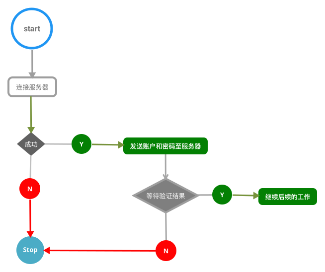

# 需求文档

### 用户登录

- 1.手机号登录

- 客户端
```  
当Pomelo应用启动后，进入登录页面，用户输入手机号和密码完成登录，完成登录后进入下级页面，
```
- 服务端
```
服务端需要验证登录用户的有效性，如果用户是初次登录，服务端创建新的用户，并存储用户密码。非首次登录，需验证密码有有效性。
```
```
初始密码可以是手机后六位，或者由用户指定密码。 取消繁琐的注册功能，用户第一次登录即完成注册。
```
- 2.第三方登录

```
第三方登录 支持QQ和微信两个平台， 客户端使用shareSDK完成，服务端需验证放平第三方平台用户数据的有效性
```

### 手机号登录流程图

